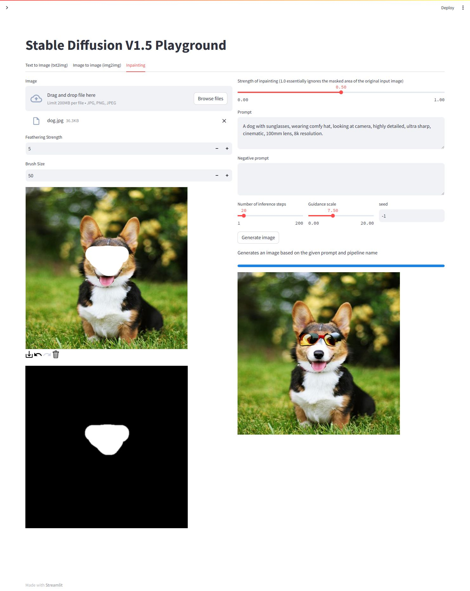

# minSDTF

Stable Diffusion V1.5 Inference With PyTorch Weights And More Features Like Stable Diffusion Web UI In TensorFlow

## Why do this?

While huggingface `diffusers` and AUTOMATIC1111 `webui` library is amazing, nowdays, its implementation has gotten
extremely big and unfriendly for people who want to build on it. I've always wished that an implementation existed that
was not only easy to learn but also easy to maintain and develop. so, I did this project. It's like building a bridge
that is compatible with the resources of the active PyTorch community, but at the same time will have the multiple
features of Keras/TensorFlow.

<div style="width: 100%; text-align: center; margin:auto;">

</div> 

#### Using pip without a virtual environment

Install dependencies using the `requirements.txt` file:

```bash
pip install -r requirements.txt
```
#### Run

```
streamlit run app.py
```

### Using the Python interface

If you installed the package, you can use it as follows:

```python 
import cv2
import numpy as np
from PIL import Image

from stable_diffusion.stable_diffusion import StableDiffusion

# load ckpt from local path:
model = StableDiffusion(img_height=512, img_width=512, jit_compile=True, clip_skip=-2,
                        unet_ckpt="/path/to/unet.safetensors",
                        vae_ckpt="/path/to/vae.safetensors",
                        text_encoder_ckpt="/path/to/text_encoder.safetensors")
img = model.text_to_image(
  "a cute girl.",
  num_steps=25,
  seed=123456)
Image.fromarray(img[0]).save("out.jpg")

# for clip skip:
model = StableDiffusion(img_height=512, img_width=512, jit_compile=True, clip_skip=-2)
img = model.text_to_image(
  "a cute girl.",
  num_steps=25,
  seed=123456)
Image.fromarray(img[0]).save("out.jpg")

# for textual inversion:
model = StableDiffusion(img_height=512, img_width=512, jit_compile=True)
img = model.text_to_image(
  "a cute girl.",
  num_steps=25,
  seed=123456,
  embedding="/path/to/embedding.pt",
  negative_embedding="/path/to/negative_embedding.pt",
)
Image.fromarray(img[0]).save("out.jpg")

# for control net(canny mode)
model = StableDiffusion(img_height=512, img_width=512, jit_compile=True, clip_skip=-2,
                        controlnet_path="/path/to/control_sd15_canny.pth")
control_net_image = "/path/to/ref_image.jpg"
image = Image.open(control_net_image)
image = np.array(image)
canny = cv2.Canny(image, 100, 200)
canny = np.expand_dims(canny, axis=-1)
canny = np.concatenate([canny, canny, canny], axis=2)
Image.fromarray(canny).save("canny.jpg")
img = model.text_to_image(
  "a cute girl.",
  num_steps=25,
  seed=123456,
  control_net_image=np.expand_dims(canny, axis=0).astype(np.float32) / 255.0
)
Image.fromarray(img[0]).save("out.jpg")

# for lora
model = StableDiffusion(img_height=512, img_width=512, jit_compile=True, lora_path="/path/to/lora.safetensors")
img = model.text_to_image(
  "a cute girl.",
  num_steps=25,
  seed=123456,
)
Image.fromarray(img[0]).save("out.jpg")

# for long prompt weighting
model = StableDiffusion(img_height=512, img_width=512, jit_compile=True)
img = model.text_to_image(
  prompt="best_quality (1girl:1.3) bow bride brown_hair closed_mouth frilled_bow frilled_hair_tubes frills (full_body:1.3) fox_ear hair_bow hair_tubes happy hood japanese_clothes kimono long_sleeves red_bow smile solo tabi uchikake white_kimono wide_sleeves cherry_blossoms",
  negative_prompt="lowres, bad_anatomy, error_body, error_hair, error_arm, error_hands, bad_hands, error_fingers, bad_fingers, missing_fingers, error_legs, bad_legs, multiple_legs, missing_legs, error_lighting, error_shadow, error_reflection, text, error, extra_digit, fewer_digits, cropped, worst_quality, low_quality, normal_quality, jpeg_artifacts, signature, watermark, username, blurry",
  num_steps=25,
  seed=123456,
)
Image.fromarray(img[0]).save("out.jpg")

# for Image To Image
model = StableDiffusion(img_height=512, img_width=512, jit_compile=True)
img = model.image_to_image(
  "a cute girl.",
  reference_image="/path/to/a_girl.jpg",
  reference_image_strength=0.8,
  num_steps=50,
)
Image.fromarray(img[0]).save("out.jpg")

# for Inpaint
model = StableDiffusion(img_height=512, img_width=512, jit_compile=True)
img = model.inpaint(
  "A dog with sunglasses, wearing comfy hat, looking at camera, highly detailed, ultra sharp, cinematic, 100mm lens, 8k resolution.",
  reference_image="/path/to/dog.jpg",
  inpaint_mask="/path/to/dog_mask.png",
  mask_blur_strength=5,
  unconditional_guidance_scale=8.0,
  reference_image_strength=0.9,
  num_steps=50,
)
Image.fromarray(img[0]).save("out.jpg")
```

* TODO
    - [x] Load Pytorch Weights
    - [x] Clip Skip
    - [x] Textual Inversion
    - [x] ControlNet
    - [x] Long Prompt Weighting
    - [x] Image To Image
    - [x] Inpainting
    - [ ] Lora
        - [x] Merge
        - [ ] Switch
    - [ ] Multi-Textual Inversion
    - [ ] Outpainting
    - [ ] Upscaler
    - [ ] Highres Fix
    - [ ] Face Restoration
    - [ ] Sampler
    - [ ] Flash Attention
    - [ ] Multi-language Prompt
    - [ ] Gui
    - [ ] Cache Manager

Distributed under the MIT License. See `LICENSE` for more information.

## Credits

Licenses for borrowed code can be found in following link:

- Stable Diffusion in TensorFlow / Keras - https://github.com/divamgupta/stable-diffusion-tensorflow
- Diffusion Bee (Stable Diffusion GUI App for MacOS) - https://github.com/divamgupta/diffusionbee-stable-diffusion-ui
- ControlNet - https://github.com/lllyasviel/ControlNet
- KerasCV - https://github.com/keras-team/keras-cv
- Diffusers - https://github.com/huggingface/diffusers
- Stable Diffusion Web UI - https://github.com/AUTOMATIC1111/stable-diffusion-webui
- Stable Diffusion 2 XL Streamlit https://github.com/dlebech/stable-diffusion-2-xl-streamlit/

## Models

- ControlNet Models - https://huggingface.co/lllyasviel/ControlNet/tree/main/models
- Dreamlike Photoreal 2.0 - https://huggingface.co/dreamlike-art/dreamlike-photoreal-2.0
- Stable Diffusion v1.5 - https://huggingface.co/runwayml/stable-diffusion-v1-5
- Fine-Tuned VAE decoder https://huggingface.co/stabilityai/sd-vae-ft-mse

## Reach me on

- WeChat: DbgMonks
- QQ: 200759103
- E-Mail: gaozhihan@vip.qq.com

## Donating

If this project useful for you, please consider buying me a cup of coffee or sponsoring me!

<a href="https://paypal.me/cpuimage/USD10" target="_blank"></a>
